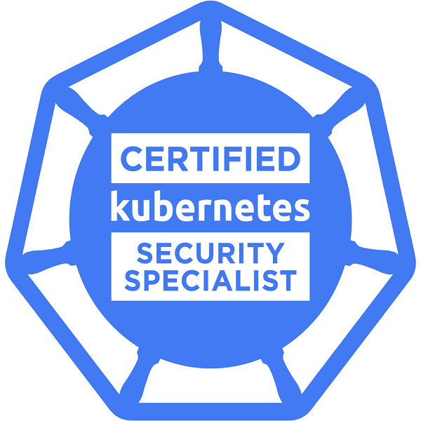
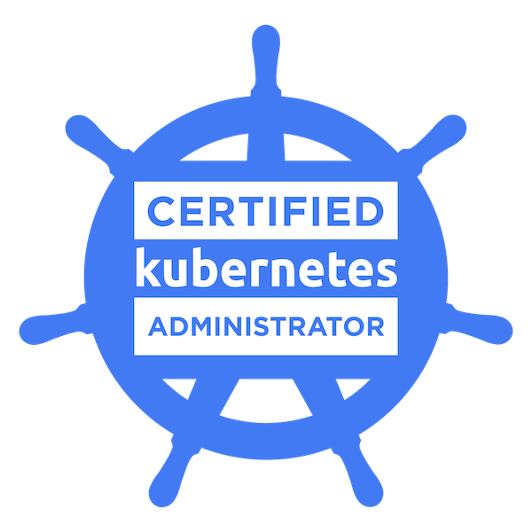
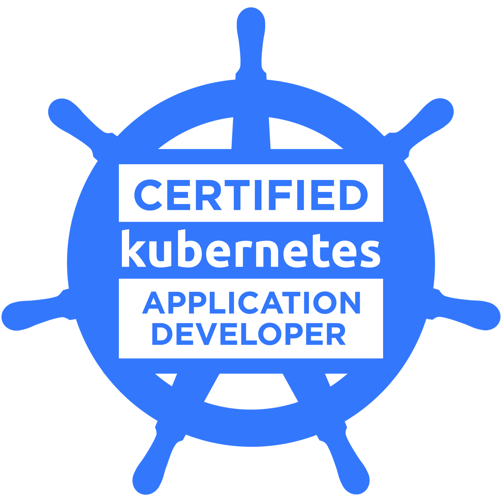
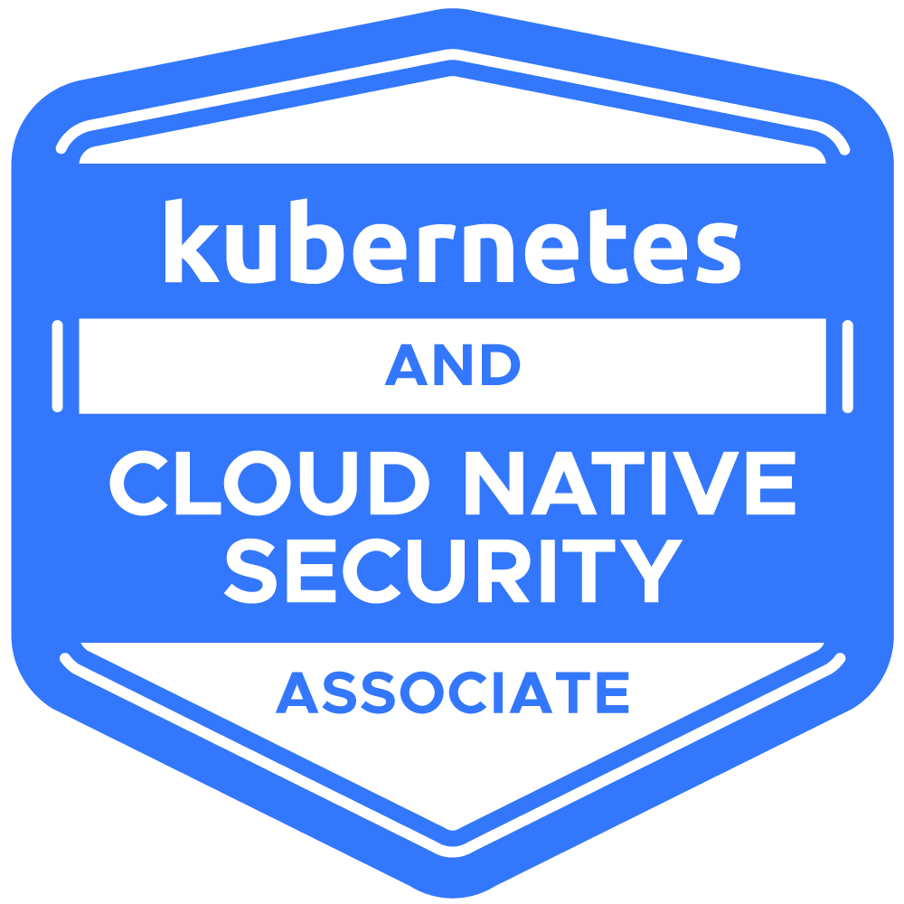
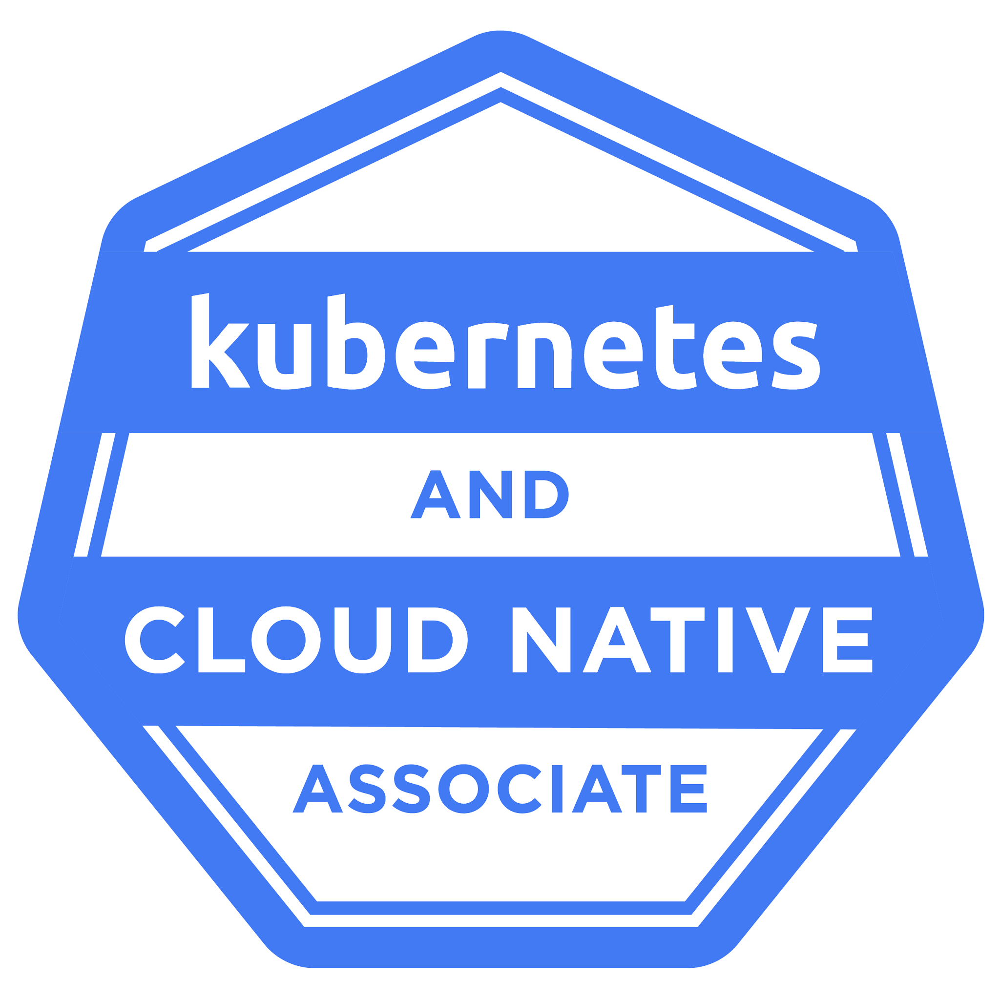
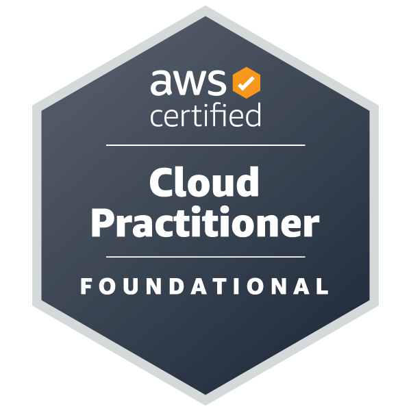

## :man: Jotaoncode

I am a humble Software Engineer that loves to learn every day new technologies, always learning from the community and trying to imrpove my self as a professional.

---

### Languages and Tools

#### Devops

 

#### Frontend

 

#### Backend

 

#### Other tools

 

### Connect

---

### Certifications, further education

#### Kubernetes

 
 

#### AWS

 
 

#

 
<h3>💻 Jotaoncode </h3>

   Started working professionaly in 2011 as a Software developer, but started writing code since I was about 13 years old inspired by my brother who was already learning electronics.
   I had the chance to learn from different industries, their needs and how they work in regards to solve their problems from a technical point of view.
   Working as a mentor of some students in a bootcamp at Thinkful was one of the most enriching experiencies.
   Father of 2 children, Argentinian living in Hamburg that every day tries to be a better professional and person, learning and listening.

[website]: https://jotaoncode.github.io
[youtube]: https://www.youtube.com/channel/UC3w8F2SQIkBg2UrwUkhx7pw

